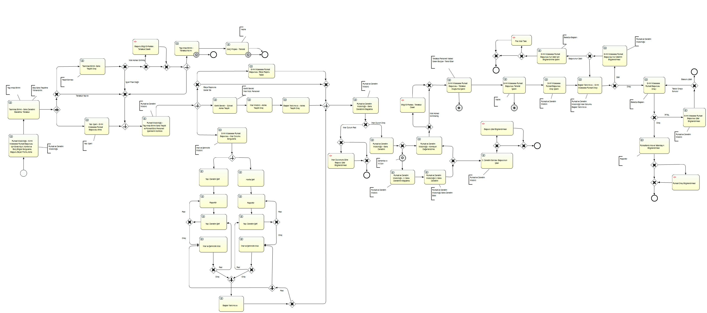

# Municipal License Process Modeling with BPMN 2.0

This project presents the end-to-end analysis and BPMN 2.0 modeling of a municipal license process completed during my work as a Business Analyst at Universal Bilgi Teknolojileri.

The process was not prepared only as documentation. It was used as the foundation of a working software flow and was successfully implemented in the product.

## Complete BPMN 2.0 process model

The diagram below is the complete, end-to-end BPMN 2.0 model I created during the analysis. It is presented in its original form without simplifying, shortening or redrawing the workflow.

The level of detail is an important part of this work. The model brings together the tasks, roles, decision points, parallel flows, approvals, rejection paths, inspections and return loops required to represent the real process as a whole.

[Open the full-resolution BPMN diagram](diagrams/license-process-bpmn.jpg)

## Project overview

Municipal license processes involve more than receiving an application and returning a decision. Applications move between different roles, pass through document and eligibility checks, require technical reviews and inspections, and may return to earlier stages when information or corrective action is needed.

My responsibility was to understand this process step by step and turn it into a model that could be discussed with stakeholders and implemented by the software team.

## What I worked on

- Analyzed the process from application intake to final approval
- Identified user roles, responsibilities and handoffs
- Defined decision points and alternative process outcomes
- Modeled parallel reviews and dependent activities
- Included missing-document, rejection and correction scenarios
- Designed inspection and reinspection loops
- Converted the complete workflow into a BPMN 2.0 model
- Supported the transfer of business rules into the software workflow
- Contributed to the successful implementation of the process in the product

## Process flow

At a high level, the application moves through the following stages:

1. Application intake
2. Initial document and eligibility checks
3. Technical reviews
4. Site inspection
5. Correction and reinspection, when required
6. Administrative approval
7. License issuance or process closure

The complete model also covers parallel activities, return paths, rejection decisions and different completion scenarios.

## Why BPMN 2.0 was useful

BPMN 2.0 provided a shared language between business stakeholders and the software team. It made the sequence of work, decision logic and role transitions visible before and during implementation.

The model helped the team:

- Discuss the complete workflow through a single process view
- Clarify responsibilities and transition points
- Detect missing paths and unclear decisions
- Translate business rules into software states and actions
- Review exception scenarios before implementation

## Outcome

The analyzed process was implemented successfully as a working software flow. The BPMN model served as a practical bridge between operational requirements and product development, rather than remaining a standalone diagram.

## Skills demonstrated

- Business process analysis
- BPMN 2.0 process modeling
- Business-rule definition
- Role and responsibility analysis
- Exception and edge-case modeling
- Requirements communication
- Collaboration with software development teams

## Repository contents

| Path | Content |
| --- | --- |
| `case-study/case-study.md` | Short project case study |
| `docs/process-overview.md` | Explanation of the main process stages |
| `docs/modeling-decisions.md` | Important BPMN modeling decisions |
| `docs/implementation-notes.md` | How the analysis supported implementation |
| `diagrams/license-process-bpmn.jpg` | Complete, original-resolution BPMN process model |
| `diagrams/license-process-overview.svg` | Optional high-level reading guide |
